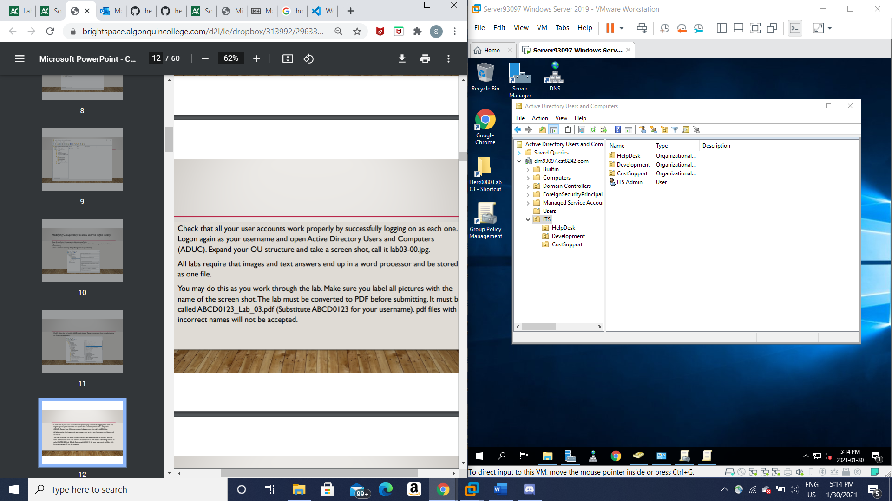

 <h1> Lab 3 Report</h1> 

| **Course Name**  | **Windows Operating System \|\|\|**| 
|:-------------| :-----------------------------:|
|Student Name  | Saeed Hersi                    |
|Student ID    | 040990543                    |

# Location 
# Screenshot 

#1
GPO
#2
You would create GPOs inside the ITS directory

# Screenshot 
.png)

# Screenshot 
.png)

# Screenshot
.png)
#6
I notice the green program file is on the menu
#7
I see the green program file is a new installed program

# Screenshot
.png)
#9
It starts to install the program then opens up but it wasnt fully installed

# Screenshot
.png)

#11
There are three new programs red, blue and green.
#12
Green application
#13
No it had to install first then open
#14
It installed first then opened.

# Screenshot
.png)

#16
No it does not show
#17
yes green application.

# Screenshot
.png)

#19
Yes because when you run the application it opens up a windows file.
#20
It installs and opens up with a windows application.

# Screenshot
.png)

#22
Yes it is still available.
#23
It does not show because its not installed yet

# Screenshot
.png)

#25
Yes CSUser can still run Cosmo1

# Screenshot
.png)

#27
No it is not available because you upgraded that application to Cosmo2
#28
Yes you can run Cosmo2 succesfully

# Screenshot
.png)

# Screenshot
.png)

# Screenshot
.png)

# Screenshot
.png)

#33
no its not available because cosmo2 is the most recent intsalled application
#34
it says another installation is already in progress and to complete with that before installing this application

# Screenshot
.png)

#36
It deletes immediately 
#37
Its is removed and no items are shown
#38
Yes it is still available because we stopped any new installations so now it should work
#39
Yes because we allowed users that already have it to continue using it but not any new installations
#40
no its not because it wasnt fully installed so it was removed
#41
Yes because it was already installed so it stayed for users that had the program installed, but not any new installations.

